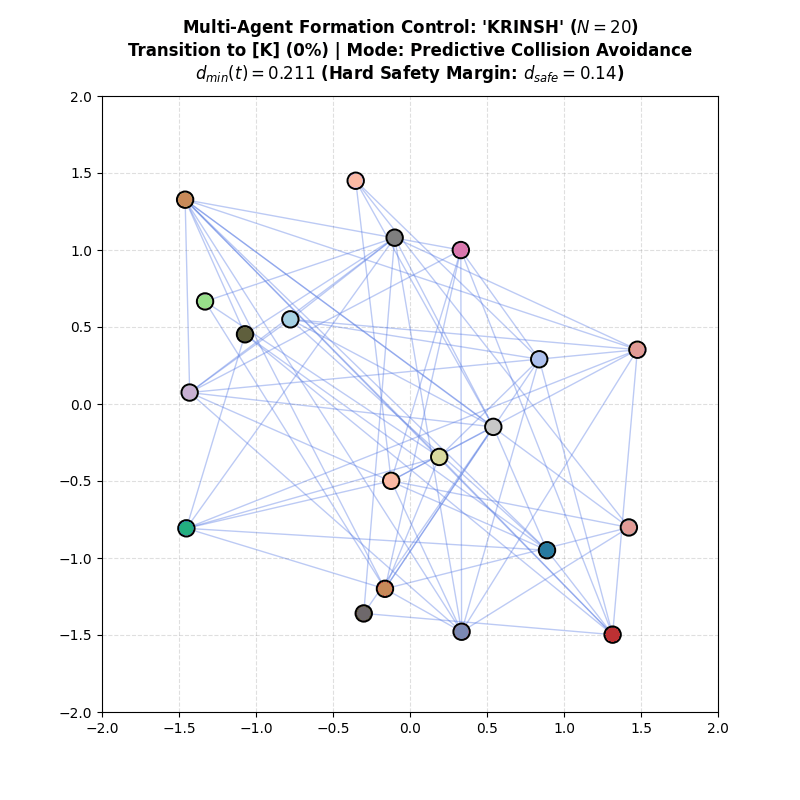

# AI3403: Multi-Agent Systems (MAS) — Assignment 3
**Department of Artificial Intelligence, Indian Institute of Technology Hyderabad**  
**Instructor:** Dr. Venkatraman Renganathan  
**Student:** DHEDHI KRINSH RAMESHBHAI (Roll No: `AI26MTECH12007`)  

---

## Problem 1: Multi-Agent Name Formation Control (`KRINSH`)

### Guaranteed Collision-Free Name Formation Animation (`K -> R -> I -> N -> S -> H`)


### Problem Overview
- **Swarm Size:** $N = 20$ autonomous agents on an undirected connected Erdős–Rényi communication graph $\mathcal{G}(\mathcal{V}, \mathcal{E})$ with $p = 0.35$ ($|E| = 71$ links).
- **Target Sequence:** **`K` $\to$ `R` $\to$ `I` $\to$ `N` $\to$ `S` $\to$ `H`** (letter by letter).
- **Control Strategy:**
  1. **Optimal Hungarian Bipartite Matching:** Assigns target letter coordinates to minimize total kinetic transit distance and prevent path crossing.
  2. **Predictive Collision Avoidance Filter:** Implements sequential deterministic priority deconfliction and lateral velocity steering to ensure hard pairwise separation ($d_{\min} = 0.1400 \ge d_{\text{safe}} = 0.140$).
  3. **Smooth Constant-Speed Gliding:** Bounded velocity ($v_{\max} = 0.035$) with stable letter hold stages.
- **Verification Telemetry:** **0 collisions** across all 631 transition frames.

### How to Run Simulation & Generate Animation
```bash
python problem1_name_formation.py
```
Outputs:
- `name_formation_krinsh.gif` (631 frames, 30 FPS animation)
- `problem1_name_formation_snapshots.png` (High-resolution snapshot grid)

---

## Problem 2: Distributed Drone Swarm Target Tracking
- **Topology:** $N = 10$ drones connected over an Erdős–Rényi graph ($|E| = 23$).
- **Algorithm:** Distributed Gradient Tracking (DGT) tracking a 3D random-walk intruder target with process and sensor noise.
- **Results:** DGT Tracking Mean RMSE $= 0.5313\text{ m}$ (Centralized BLUE bound $= 0.6026\text{ m}$), Swarm Consensus Disagreement $< 5.20 \times 10^{-3}\text{ m}$.
```bash
python problem2_target_tracking.py
```

---

## Problem 3: Distributed Multi-Agent Task Allocation via ADMM
- **Setup:** $N = 6$ agents, $M = 15$ tasks, agent capacities $b = [3, 2, 4, 1, 3, 2]^\top$ ($\sum b_i = 15$).
- **Algorithm:** ADMM Sharing formulation with continuous convex relaxation and $\mathcal{O}(M)$ scalar threshold hypersimplex projection.
- **Theory:** Total Unimodularity (TUM) guarantees exact binary integer allocation with zero integrality gap.
- **Results:** Final ADMM Cost $= 66.7236$ (matches Centralized LP exactly, primal residual $= 0.00$).
```bash
python problem3_task_allocation_admm.py
```

---

## Problem 4: Closed-Form ADMM for LASSO Optimization
- **Problem:** $\min_x \frac{1}{2}\|Ax - b\|_2^2 + \lambda \|x\|_1$.
- **Updates:**
  - $x^{k+1} = (A^\top A + \rho I_n)^{-1}(A^\top b + \rho(z^k - u^k))$ (Least-squares proximal step)
  - $z^{k+1} = \mathcal{S}_{\lambda/\rho}(x^{k+1} + u^k)$ (Soft-thresholding operator)
  - $u^{k+1} = u^k + (x^{k+1} - z^{k+1})$ (Scaled dual update)
- **Results:** Primal residual $= 3.85 \times 10^{-6}$, 10/10 exact sparse feature recovery.
```bash
python problem4_lasso_admm.py
```

---

## Repository Structure
```
├── README.md                              # This repository documentation
├── name_formation_krinsh.gif              # Problem 1 recorded animation video
├── problem1_name_formation.py             # Problem 1 simulation script
├── problem1_name_formation_snapshots.png  # Problem 1 formation snapshots
├── problem2_target_tracking.py            # Problem 2 simulation script
├── problem2_target_tracking.png           # Problem 2 3D tracking & error plots
├── problem3_task_allocation_admm.py       # Problem 3 ADMM task allocation script
├── problem3_task_allocation_admm.png      # Problem 3 communication & heatmap plots
├── problem4_lasso_admm.py                 # Problem 4 LASSO closed-form ADMM script
├── problem4_lasso_admm.png                # Problem 4 convergence & shrinkage plots
├── Assignment3_Solution.tex               # Complete LaTeX source code
└── ai26mtech12007Assignment3.pdf          # Final master submission PDF
```
